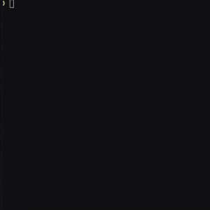

# lacam3

[](LICENSE)
[](https://github.com/Kei18/lacam3/actions/workflows/ci.yml)

This is a code repository of the paper ["Engineering LaCAM*: Towards Real-Time, Large-Scale, and Near-Optimal Multi-Agent Pathfinding"](https://kei18.github.io/lacam3/) (AAMAS-24).


LaCAM(*) is a search-based algorithm for MAPF that can address large instances, e.g., with more than 1k agents.
If you are interested in academic background, check out [this talk](https://www.cl.cam.ac.uk/seminars/wednesday/video/20231101-1500-t204508.html) and [slides](https://speakerdeck.com/kei18/pathfinding-for-10k-agents-5534305f-45e3-4712-9605-ef112be6a7c5).
There is [a toy Python implementation](https://github.com/Kei18/py-lacam) as well.

This is the third generation of LaCAM:
[[lacam; AAAI-23]](https://kei18.github.io/lacam/)
[[lacam2; IJCAI-23]](https://kei18.github.io/lacam2).
The evolution is depicted below.
My prior studies such as [[pibt2; AIJ-22]](https://kei18.github.io/pibt2/) and [[mapf-IR; IROS-21]](https://kei18.github.io/mapf-IR/) (concurrent with [LNS](https://github.com/Jiaoyang-Li/MAPF-LNS)) also play important roles.


## News

- Mar. 2025. You can now call lacam3 from Python! Check [pybind](https://github.com/Kei18/lacam3/tree/pybind) branch.
  Thanks to [@TD0013](https://github.com/TD0013) for creating the interface.


## Demo

[lacam2](https://kei18.github.io/lacam2) (left) vs. lacam3 (right, this repo) 🚀🪄



_random-32-32-20.map, 409 agents, 30sec timeout, on Mac Book Pro (M2 Max)_

## Building

All you need is [CMake](https://cmake.org/) (≥v3.16).
The code is written in C++(17).

First, clone this repo with submodules.

```sh
git clone --recursive https://github.com/Kei18/lacam3.git && cd lacam3
```

Then, build the project.

```sh
cmake -B build && make -C build
```

## Usage

```sh
build/main -i assets/random-32-32-10-random-1.scen -m assets/random-32-32-10.map -N 300 -v 3
```

The result will be saved in `build/result.txt`.

You can find details of all parameters with:

```sh
build/main --help
```

In fact, there are many hyperparameters (though I dislike).
The default setting is usually an okay level to my knowledge.

## Visualizer

This repository is compatible with [kei18@mapf-visualizer](https://github.com/kei18/mapf-visualizer).

## Experiments

The experimental script is written in Julia ≥1.7.
Setup may require around 10 minutes.


```sh
sh scripts/setup.sh
```

Edit the config file as you like.
Examples are in `scripts/config` .
The evaluation starts by following commands.

```
julia --project=scripts/ --threads=auto
> include("scripts/eval.jl"); main("scripts/config/mapf-bench.yaml")
```

The results will be saved in `../data/`.

<details>
<summary>examples used in the paper</summary>

### space utilization optimization

```jl
include("scripts/eval.jl"); target="scripts/config/exp_scatter"; foreach(x -> main("$(target)/common.yaml", x), filter(x -> !contains(x, "common"), glob("$(target)/*.yaml")))
```

### Monte-Carlo configuration generator

```jl
include("scripts/eval.jl"); target="scripts/config/exp_mccg"; foreach(x -> main("$(target)/common.yaml", x), filter(x -> !contains(x, "common"), glob("$(target)/*.yaml")))
```

</details>


## Licence

This software is released under the MIT License, see [LICENSE.txt](LICENCE.txt).

If possible, please consider contacting the author for commercial use. This is not a restriction, I just want to know about the use as an academic researcher.

## Notes

### install pre-commit for formatting

```sh
pre-commit install
```

### simple test

```sh
ctest --test-dir ./build
```

### others

- The grid maps and scenarios files are (mostly) from [MAPF benchmarks](https://movingai.com/benchmarks/mapf.html), with some original ones.
  They are placed in `./scripts/map` and `./scripts/scen`.
- lacam4? I do not have such a plan currently...
